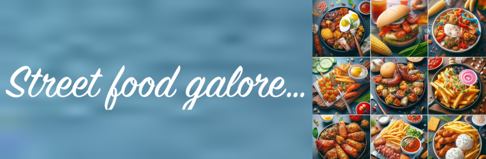

# Nigerian Street Foods

This is a static web app that displays Nigerian street foods on a shopping site. The app reads the data from a static JSON file and uses a green and white color theme.

## Project Structure

The project has the following files and directories:

- `src/index.html`: The main HTML file of the web app.
- `src/styles/main.css`: The CSS styles for the web app.
- `src/scripts/main.js`: The JavaScript code for the web app.
- `src/data/foods.json`: The static JSON file containing the street food data.
- `assets/favicon.ico`: The favicon for the web app.
- `README.md`: Documentation for the project.

## Setup

To set up and run the web app, follow these steps:

1. Clone the repository.
2. Open the `src/index.html` file in a web browser.
3. The web app will display the Nigerian street foods using the green and white color theme.

## Data

The street food data is stored in the `src/data/foods.json` file. You can modify this file to add, remove, or update the street food information.

## Color Theme

The web app uses a green and white color theme. The CSS styles in the `src/styles/main.css` file define the colors and styles for the web page elements.

Feel free to customize the color theme by modifying the CSS styles in the `src/styles/main.css` file.

## License

This project is licensed under the MIT License. See the [LICENSE](LICENSE) file for more information.